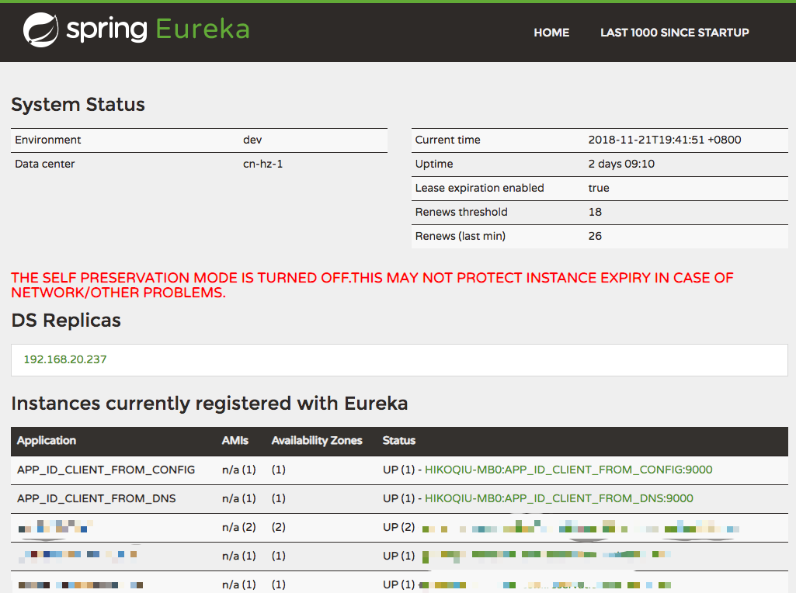
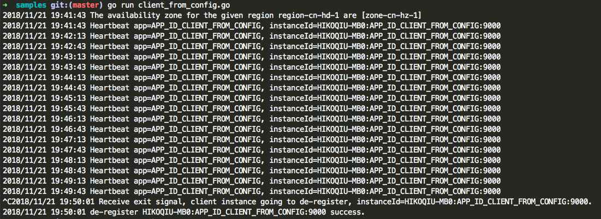

### go-eureka-client

Non-offical implementation of Spring Cloud Eureka client.

Tips: Non-full-features, only some basic and useful features implemented.


#### Spring Cloud Eureka Configurations

| FEATURES | Support |
|:--------:|:-------:|
|AvailabilityZones| √ |
|ServiceUrl| √ |
|UseDnsForFetchingServiceUrls| √ |
|RegisterWithEureka| √ |
|PreferSameZoneEureka| √ |
|FilterOnlyUpInstances| √ |
|RegistryFetchIntervalSeconds| √ |
|FetchRegistry| √ |
|EurekaServerPort| √ |
|EurekaServerUrlContexts| √ |

#### go-eureka-client extended features

| FEATURES | Support |
|:--------:|:-------:|
|AutoUpdateDnsServiceUrls| √ |
|AutoUpdateDnsServiceUrlsIntervals| √ |
|HeartbeatIntervals| √ |

### Samples

#### Sample 1

Get Eureka server urls from configuration, e.g:

````
    config := eureka.GetDefaultEurekaClientConfig()
    config.UseDnsForFetchingServiceUrls = false
    config.Region = "region-cn-hd-1"
    config.AvailabilityZones = map[string]string{
        "region-cn-hd-1": "zone-cn-hz-1",
    }
    config.ServiceUrl = map[string]string{
        "zone-cn-hz-1": "http://192.168.20.236:9001/eureka,http://192.168.20.237:9001/eureka",
    }

    // custom logger
    //eureka.SetLogger(func(format string, a ...interface{}) {
    //   fmt.Println("[custom logger] " + format, a)
    //})

    // run eureka client async
    eureka.DefaultClient.SetConfig(config).
        Register("APP_ID_CLIENT_FROM_CONFIG", 9000).
        Run()

    select {}
````

Full sample code, refer to: [samples/client_from_config.go](./samples/client_from_config.go)

#### Sample 2

Get Eureka server urls from dns(TXT Record) lookup, e.g:

````
    config := eureka.GetDefaultEurekaClientConfig()
    config.UseDnsForFetchingServiceUrls = true
    config.Region = "region-cn-hd-1"
    config.AvailabilityZones = map[string]string{
        "region-cn-hd-1": "zone-cn-hz-1",
    }
    config.EurekaServerDNSName = "dev.ms-registry.xf.io"
    config.EurekaServerUrlContext = "eureka"
    config.EurekaServerPort = "9001"

    // custom logger
    //eureka.SetLogger(func(format string, a ...interface{}) {
    //   fmt.Println("[custom logger] " + format, a)
    //})

    // run eureka client async
    eureka.DefaultClient.SetConfig(config).
        Register("APP_ID_CLIENT_FROM_DNS", 9000).
        Run()

    select {}
````

Full sample code, refer to: [samples/client_from_dns.go](./samples/client_from_dns.go)

#### Sample 3

Eureka Server REST api util, e.g:

````
    config := eureka.GetDefaultEurekaClientConfig()
    config.UseDnsForFetchingServiceUrls = false
    config.Region = "region-cn-hd-1"
    config.AvailabilityZones = map[string]string{
        "region-cn-hd-1": "zone-cn-hz-1",
    }
    config.ServiceUrl = map[string]string{
        "zone-cn-hz-1": "http://192.168.20.236:9001/eureka,http://192.168.20.237:9001/eureka",
    }

    c := eureka.DefaultClient.SetConfig(config)
    api, err := c.Api()
    if err != nil {
        log.Fatalln("Failed to pick EurekaServerApi instance, err=", err.Error())
    }
    instances, err := api.QueryAllInstances()
    if err != nil {
        log.Fatalln("Failed to query all instances, err=", err.Error())
    }

    log.Println("all instances: ", instances)
````

Full sample code, refer to: [samples/eureka_api_rest.go](./samples/eureka_api_rest.go)

Eureka server Rest api supported, refer to list below:


| Operation | HTTP action | Support |
|-----------|-------------|-------------|
| Register new application instance | POST /eureka/v2/apps/**appID** | √ |
| De-register application instance | DELETE /eureka/v2/apps/**appID**/**instanceID** | √ |
| Send application instance heartbeat | PUT /eureka/v2/apps/**appID**/**instanceID** | √ |
| Query for all instances | GET /eureka/v2/apps | √ |
| Query for all **appID** instances | GET /eureka/v2/apps/**appID** | √ |
| Query for a specific **appID**/**instanceID** | GET /eureka/v2/apps/**appID**/**instanceID** | √ |
| Query for a specific **instanceID** | GET /eureka/v2/instances/**instanceID** | √ |
| Take instance out of service | PUT /eureka/v2/apps/**appID**/**instanceID**/status?value=OUT_OF_SERVICE| √ |
| Move instance back into service (remove override) | DELETE /eureka/v2/apps/**appID**/**instanceID**/status?value=UP  (The value=UP is optional, it is used as a suggestion for the fallback status due to removal of the override)| √ |
| Update metadata | PUT /eureka/v2/apps/**appID**/**instanceID**/metadata?key=value| √ |
| Query for all instances under a particular **vip address** | GET /eureka/v2/vips/**vipAddress** | × |
| Query for all instances under a particular **secure vip address** | GET /eureka/v2/svips/**svipAddress** | × |

### Registry screenshots



### Client heartbeat



